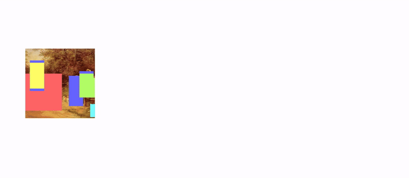

# I Dream My Painting: Connecting MLLMs and Diffusion Models via Prompt Generation for Text-Guided Multi-Mask Inpainting (WACV 2025)

This repository contains the reference code for the paper "I Dream My Painting: Connecting MLLMs and Diffusion Models via Prompt Generation for Text-Guided Multi-Mask Inpainting".



* [Installation](#installation)
* [Prepare Dataset](#prepare-dataset)
    * [Download the Images](#download-the-images)
    * [Make the Dataset](#make-the-dataset)
* [Setup Multi-Mask Inpainting with RCA](#setup-multi-mask-inpainting-with-rca)
* [Download Model Weights](#download-model-weights)
* [Try the Model!](#try-the-model)
* [Experiments](#experiments)
    * [Prerequisites](#prerequisites)
        * [Models](#models)
        * [Logging](#logging)
    * [Prompt Generation](#prompt-generation)
    * [Multi-Mask Inpainting](#multi-mask-inpainting)

## Installation

Prerequisites: CUDA>=12.1, Conda for environment management, Git LFS  for downloading Stable Diffusion 2 Inpainting.

Use the following command to install the Conda environment:

```bash
conda env create -f env.yaml
```

Activate the environment with:

```bash
conda activate i-dream-my-painting
```

Next, install the English language model for spaCy:

```bash
python -m spacy download en_core_web_sm
```

## Prepare Dataset

We provide the results of the Kosmos-2 model for global image annotations and the LLaVA model for object-level annotations, hoping to facilitate research in the computer vision and artistic domain.
Enter the `data` directory and unzip the annotations files:

```bash
unzip annotations.zip
```

This will create the `annotations.json` file with the global image annotations and the `llava.json` file with the object-level annotations. The object-level annotations can be used **only after** the [Make the Dataset](#make-the-dataset) step.

### Download the Images

To download the images at our thumbnail sizes using the WikiArt API, you can use the following command:

```bash
python -m inpainting.data.downloader download-and-save-images-wikiart-v2 -o data/mm_inp_dataset/images
```

The tqdm progress bar may stop because of multi-processing. Sometimes there might be download errors. Repeat the above command to download the missing images in case of errors. You will have downloaded all images if the command:

```bash
ls data/mm_inp_dataset/images | wc -l
```

returns 116475.

### Make the Dataset

The code for data annotation and preprocessing is available in the `inpainting.data` package. We provide the commands to run the annotation and preprocessing scripts using the Kosmos-2 outputs in the `data/annotations.json` file. If you have downloaded the images as in the [Download the Images](#download-the-images) step and have the provided files `data/annotations.json` and `data/llava.json`, **you can skip the most time-consuming step 4**, for LLAVA captioning, and move directly to step 5.

1. Make masks from annotations (~10min):

    ```bash
    python -m inpainting.data.ops make-masks-dataset --annotations-path data/annotations.json --image-dir data/mm_inp_dataset/images --out-dir data/mm_inp_dataset/masks
    ```
    This will save masks as PNG images in the `data/mm_inp_dataset/masks` directory. The directory will contain one subdirectory per image, each containing the masks for that image with denominations `mask_0.png`, `mask_1.png`, etc.

2. Make entities dataset (~10min):
    ```bash
    python -m inpainting.data.ops make-entities-dataset --annotations-path data/annotations.json --image-dir data/mm_inp_dataset/images --out-dir data/mm_inp_dataset/entities
    ```
    This will save crops from the images corresponding to the bounding boxes detected by Kosmos-2. For entities that correspond to multiple bounding boxes, the crops are put together in a single image. The directory will contain one subdirectory per image, each containing the crops for that image with denominations `mask_0.png`, `mask_1.png`, etc. Additionally, each subdirectory will contain an `annotations.json` file with a dictionary whose keys are the masks (denominated as `mask_0`, `mask_1`, etc.) and whose values are another dictionary with the key `concept` and the noun chunk detected by Kosmos-2.

3. Extract noun chunk roots using Spacy (~2min):
    ```bash
    python -m inpainting.data.ops extract-noun-chunk-roots --entities-dir data/mm_inp_dataset/entities
    ```
    This will update the image-specific annotations files in the `data/mm_inp_dataset/entities` directory with the key `noun_chunk_root` whose value is the root of the noun chunk detected by Kosmos-2 (used for accuracy evaluation).

4. Caption masks (hours) - skip if you have `data/llava.json`:
    ```bash
    python -m inpainting.data.ops caption-masks --entities-dir data/mm_inp_dataset/entities --model-id llava-hf/llava-v1.6-vicuna-13b-hf --batch-size 8 --max-new-tokens 40 --num-processes 1 --process-id 0
    ```
    This will use LLaVA-1.6-Vicuna-13B to caption the masks and create object-level annotations. You can run this script multiple times with different `--process-id` values to parallelize the process (and setting `--num-processes` to the number of parallel processes). The script will save the LLaVA outputs every 100 steps in a backup json file, whose keys are the image names and whose values are dictionaries with the keys `mask_0`, `mask_1`, etc. and whose values are the captions. Backups are saved with the name `backup_{process_id}.json` in the directory where the script is run. They will also contain an additional key `steps` to keep track of the number of steps taken. Continuing the process from a backup file is not implemented in the script, but it can be done manually by adjusting the code. At the end, the final annotations will be saved in the file `backup_{process_id}_final.json` in the directory where the script is run.

5. Move LLaVA annotations to the entities directory (~5sec):
    
    If you have downloaded the dataset as indicated in the Section [Download Dataset](#download-dataset), you can move the LLaVA annotations to the entities directory with the following command:
    ```bash
    python -m inpainting.data.ops llava-annotations-to-folder --annotations-path data/llava.json --out-dir data/mm_inp_dataset/entities
    ```
    otherwise, if you have executed the previous step, you can move the annotations with the following command:
    ```bash
    python -m inpainting.data.ops llava-annotations-to-folder --annotations-path backup_{process_id}_final.json --out-dir data/mm_inp_dataset/entities
    ```
    This will move the LLaVA annotations from the backup file to the entities directory, creating a new file `llava.json` whose keys are the masks and whose values are the captions, in the corresponding image subdirectory.

6. Clean and save LLaVA annotations (~10sec):
    ```bash
    python -m inpainting.data.ops llava-annotations-to-entity-annotations --entities-dir data/mm_inp_dataset/entities
    ```
    This will clean the LLaVA annotations (remove prefix, make lowercase, remove strange characters) and save them in the `annotations.json` file in the image subdirectories. For each mask, a new key `caption` is added to the dictionary with the cleaned caption.

7. Split dataset (dataset is already split if you have downloaded the dataset as indicated in the Section [Download Dataset](#download-dataset)):
    ```bash
    python -m inpainting.data.ops train-val-test-split --image-dir data/mm_inp_dataset/images --masks-dir data/mm_inp_dataset/masks --split-df-path data/wikiart_images.csv
    ```
    This will split the dataset into training, validation, and test sets, saving the corresponding image files in subdirectories with names `train`, `val`, and `test` in the `data/mm_inp_dataset/images` directory. Images without masks are saved in the `unannotated` subdirectory.

At the end of this process the dataset examples will look like this:


Where the image is associated with multiple masks (in the `masks` dir) and for each mask we have an object crop with its LLaVA-generated object-level description (in the `entities` dir).

## Setup Multi-Mask Inpainting with RCA

To use our **multi-mask inpainting** model, you need to clone the `stabilityai/stable-diffusion-2-inpainting` model using Git LFS from its [repository](https://huggingface.co/stabilityai/stable-diffusion-2-inpainting/tree/main) on the Hugging Face Hub. In the repository, click on the icon with three vertical dots, select "Clone repository," and follow the instructions to clone the repo into the `models` directory (you should have a `models/stable-diffusion-2-inpainting` directory).

Next, replace `stable-diffusion-2-inpainting/model_index.json` and `stable-diffusion-2-inpainting/unet/config.json` with the files from the `models/sd_replacements` directory of this repository.

## Download Model Weights

Download the model weights from [this URL](https://drive.google.com/drive/folders/1_O7XTDjU-EgbjGwVT194NQJemdZXcrMe?usp=drive_link).

* Prompt generation (**LLaVA-MultiMask**): unzip the folder `multimask.zip` and move it to the `models/llava` directory. This folder also includes the optimizer states and other data needed to continue training.
* Multi-mask inpainting (**SD-2-Inp-RCA-FineTuned**): unzip the folder `rca.zip` and move it to the `models/sd` directory.

## Try the Model!


If you have performed the steps in the [Prepare Dataset](#prepare-dataset) sections, and have downloaded the model weights as indicated in the [Download Model Weights](#download-model-weights) section, also setting up the Multi-Mask Inpainting with RCA as indicated in the [Setup Multi-Mask Inpainting with RCA](#setup-multi-mask-inpainting-with-rca) section, you can now try the model!

Go in the `notebooks` directory and run the `try_pipe.ipynb` notebook.

## Experiments

### Prerequisites

#### Models

To train the models you have to download them from [🤗 Hugging Face Hub](https://huggingface.co/docs/hub/models-downloading). Please, download the following models:

* [`llava-hf/llava-v1.6-vicuna-7b-hf`](https://huggingface.co/llava-hf/llava-v1.6-vicuna-7b-hf)
* [`openai/clip-vit-base-patch32`](https://huggingface.co/openai/clip-vit-base-patch32)
* [`stabilityai/stable-diffusion-2-inpainting`](https://huggingface.co/stabilityai/stable-diffusion-2-inpainting)

#### Logging

To log the training process, you need to have a [Weights & Biases account](https://wandb.ai/login) and install the `wandb` package:

```bash
pip install wandb
```

If you are running this code on a HPC cluster, it is possible that you'll need to log information offline:

```bash
wandb offline
```

### Prompt Generation

We present prompt generation results:

|                           | Accuracy (%)  | BLEU@1  | BLEU@4  | ROUGE-L  | CLIPSim  |
|---------------------------|---------------|---------|---------|----------|----------|
| LLaVA-Prompt               | 7.74          | 20.81   | 1.30    | 19.99    | 22.46    |
| LLaVA-1Mask            | **36.52**     | 36.99   | 12.58   | _34.64_  | _24.65_  |
| LLaVA-MultiMask-1Pred  | _35.48_       | **37.68**| **13.15**| **34.98**| **24.79**|
| LLaVA-MultiMask-LastPred   | 33.08         | _37.40_ | _12.61_ | 34.45    | 24.46    |
| LLaVA-MultiMask-All        | 31.73         | 37.33   | 12.43   | 34.33    | 24.24    |

And we provide the commands to reproduce them:

1. **LLaVA-Prompt**

   * Test
     ```bash
     accelerate launch -m inpainting.models.image_to_text.fine_tune_llavanext train --config-path=models/configs/image_to_text/test/config_base.yaml
     ```

2. **LLaVA-1Mask**
   
   * Train
     ```bash
     accelerate launch -m inpainting.models.image_to_text.fine_tune_llavanext train --config-path=models/configs/image_to_text/train/llava_1mask.yaml
     ```

   * Test
     ```bash
     accelerate launch -m inpainting.models.image_to_text.fine_tune_llavanext train --config-path=models/configs/image_to_text/test/llava_1mask.yaml
     ```


3. **LLaVA-MultiMask**

   * Train
     ```bash
     accelerate launch -m inpainting.models.image_to_text.fine_tune_llavanext train --config-path=models/configs/image_to_text/train/llava_multimask.yaml
     ```
        

   * Test (LLaVA-MultiMask-1Pred)
     ```bash
     accelerate launch -m inpainting.models.image_to_text.fine_tune_llavanext train --config-path=models/configs/image_to_text/test/llava_multimask_1pred.yaml
     ```

    * Test (LLaVA-MultiMask-LastPred and LLaVA-MultiMask-All)
      ```bash
      accelerate launch -m inpainting.models.image_to_text.fine_tune_llavanext train --config-path=models/configs/image_to_text/test/llava_multimask.yaml
      ```

We trained the models for 1 epoch on four NVIDIA A100 64GB GPUs, where a single training requires ~9.5 hours. Tests are performed on a single NVIDIA A100 64GB GPU. They require ~6 hours.

Once a training or test is completed the results will be logged to Weights & Biases.

### Multi-Mask Inpainting

We present multi-mask inpainting results:

|                           | FID ↓           | LPIPS ↓         | PSNR ↑         | CLIP-IQA ↑       | CLIPSim-I2I ↑  | CLIPSim-T2I ↑  |
|---------------------------|-----------------|-----------------|----------------|------------------|----------------|----------------|
| SD-2-Inp-HQPrompt          | 19.18 (31.86)   | 22.82 (24.29)   | 14.55 (**14.36**) | 71.51 (73.89)   | 84.87 (85.63)  | 21.10 (20.92)  |
| SD-2-Inp               | **15.07** (**27.40**) | **21.90** (**23.63**) | **14.66** (_14.35_) | 73.10 (75.74)  | 88.87 (88.93)  | 25.70 (24.91)  |
| SD-2-Inp-RCA               | 15.39 (28.03)   | 21.98 (23.78)   | _14.59_ (14.24) | 73.24 (75.83)   | 88.83 (88.85)  | 25.81 (25.04)  |
| SD-2-Inp-FineTuned         | 15.49 (27.83)   | 22.06 (23.96)   | 14.44 (14.06)   | **74.64** (**77.68**) | _89.05_ (_89.04_) | _26.31_ (_25.40_) |
| SD-2-Inp-RCA-FineTuned | 15.32 (_27.45_) | _22.00_ (_23.74_) | 14.46 (14.13)  | _74.30_ (_77.21_) | **89.28** (**89.35**) | **26.72** (**25.93**) |
| SD-2-Inp-RCA-FineTuned-Gen | _15.30_ (27.94) | 22.69 (24.42)   | 14.05 (13.64)   | 72.80 (76.01)   | 87.47 (87.68)  | 23.25 (22.94)  |

And we provide the commands to reproduce them:

1. **SD-2-Inp-HQPrompt**

   * Generate
     ```bash
     python -m inpainting.models.text_to_image.test generate --config-path models/configs/text_to_image/test/sd_2_inp_hqprompt.yaml
     ```

   * Compute
     ```bash
     python -m inpainting.models.text_to_image.test compute --config-path models/configs/text_to_image/test/sd_2_inp_hqprompt.yaml
     ```

2. **SD-2-Inp**

    * Generate
      ```bash
      python -m inpainting.models.text_to_image.test generate --config-path models/configs/text_to_image/test/sd_2_inp.yaml
      ```
    
    * Compute
      ```bash
      python -m inpainting.models.text_to_image.test compute --config-path models/configs/text_to_image/test/sd_2_inp.yaml
      ```

3. **SD-2-Inp-RCA**
   
    * Generate
      ```bash
      python -m inpainting.models.text_to_image.test generate --config-path models/configs/text_to_image/test/sd_2_inp_rca.yaml
      ```
    
    * Compute
      ```bash
      python -m inpainting.models.text_to_image.test compute --config-path models/configs/text_to_image/test/sd_2_inp_rca.yaml
      ```


4. **SD-2-Inp-FineTuned**

   * Train
     ```bash
     accelerate launch -m inpainting.models.text_to_image.train_text_to_image_lora main --config-path=models/configs/text_to_image/sd_2_inp_finetuned.yaml
     ```

   * Generate
     ```bash
     python -m inpainting.models.text_to_image.test generate --config-path models/configs/text_to_image/test/sd_2_inp_finetuned.yaml
     ```

   * Compute
     ```bash
     python -m inpainting.models.text_to_image.test compute --config-path models/configs/text_to_image/test/sd_2_inp_finetuned.yaml
     ```

5. **SD-2-Inp-RCA-FineTuned**

   Preliminary: to perform this experiment you need to clone the `stabilityai/stable-diffusion-2-inpainting` repository and edit the model files as explained in the Section [Download Model Weights](#download-model-weights).

   * Train
     ```bash
     accelerate launch -m inpainting.models.text_to_image.train_text_to_image_lora main --config-path=models/configs/text_to_image/sd_2_inp_rca_finetuned.yaml
     ```

   * Generate
     ```bash
     python -m inpainting.models.text_to_image.test generate --config-path models/configs/text_to_image/test/sd_2_inp_rca_finetuned.yaml
     ```

   * Compute
     ```bash
     python -m inpainting.models.text_to_image.test compute --config-path models/configs/text_to_image/test/sd_2_inp_rca_finetuned.yaml
     ```

6. **SD-2-Inp-RCA-FineTuned-Gen**

   * Train: not needed, the used model is the same as the previous one.

   * Generate prompts
     ```bash
     python -m inpainting.models.text_to_image.test generate-prompts --config-path models/configs/text_to_image/test/sd_2_inp_rca_finetuned_gen.yaml
     ```

   * Generate
     ```bash
     python -m inpainting.models.text_to_image.test generate --config-path models/configs/text_to_image/test/sd_2_inp_rca_finetuned_gen.yaml
     ```

   * Compute
     ```bash
     python -m inpainting.models.text_to_image.test compute --config-path models/configs/text_to_image/test/sd_2_inp_rca_finetuned_gen.yaml
     ```
